# Diagramas de Flujo - Taskbot-API

## 1. Proceso de Inicialización del Servidor

```mermaid
flowchart TD
    A[Servidor inicia] --> B[Importar dependencias]
    B --> C[Configurar Express app]
    C --> D[Configurar middleware global]
    D --> E[Configurar cola de procesamiento]
    E --> F[Configurar logging middleware]
    F --> G[Configurar body parser]
    
    G --> H[Registrar rutas]
    H --> I[/api/user routes]
    H --> J[/api/task routes]
    H --> K[/api/subtask routes]
    H --> L[/api/mcp routes]
    
    I --> M[Middleware de autenticación]
    J --> N[Middleware de autenticación]
    K --> O[Middleware de autenticación]
    L --> P[Middleware de autenticación]
    
    M --> Q[Conectar a base de datos]
    N --> Q
    O --> Q
    P --> Q
    
    Q --> R{¿Conexión exitosa?}
    R -->|Sí| S[Iniciar servidor en puerto]
    R -->|No| T[Error de conexión DB]
    
    S --> U[Servidor listo]
    T --> V[Terminar proceso]
```

## 2. Proceso de Autenticación y Autorización


## 3. Proceso de Gestión de Usuarios


## 4. Proceso de Gestión de Tareas


## 5. Proceso de Gestión de Subtareas

```mermaid
flowchart TD
    A[GET /api/task/:taskId/subtask] --> B[Autenticar usuario]
    B --> C[Verificar propiedad de tarea padre]
    C --> D{¿Tarea padre existe?}
    D -->|Sí| E[Obtener subtareas de la tarea]
    D -->|No| F[Error 404 - Tarea padre no encontrada]
    
    E --> G{¿Query exitoso?}
    G -->|Sí| H[Devolver subtareas]
    G -->|No| I[Error 500 - Error de DB]
    
    J[POST /api/task/:taskId/subtask] --> K[Autenticar usuario]
    K --> L[Verificar propiedad de tarea padre]
    L --> M[Validar campos de subtarea]
    M --> N{¿Campos válidos?}
    N -->|Sí| O[Insertar subtarea en DB]
    N -->|No| P[Error 400 - Campos faltantes]
    
    O --> Q{¿Inserción exitosa?}
    Q -->|Sí| R[Obtener subtarea creada]
    Q -->|No| S[Error 500 - Error de DB]
    
    R --> T[Respuesta 201 con subtarea]
    
    U[PUT /api/subtask/:id] --> V[Autenticar usuario]
    V --> W[Verificar propiedad de subtarea]
    W --> X{¿Subtarea existe y pertenece al usuario?}
    X -->|Sí| Y[Actualizar campos especificados]
    X -->|No| Z[Error 404 - Subtarea no encontrada]
    
    Y --> AA{¿Actualización exitosa?}
    AA -->|Sí| BB[Obtener subtarea actualizada]
    AA -->|No| CC[Error 500 - Error de DB]
    
    BB --> DD[Respuesta 200 con subtarea]
    
    EE[DELETE /api/subtask/:id] --> FF[Autenticar usuario]
    FF --> GG[Verificar propiedad de subtarea]
    GG --> HH{¿Subtarea existe y pertenece al usuario?}
    HH -->|Sí| II[Eliminar subtarea de DB]
    HH -->|No| JJ[Error 404 - Subtarea no encontrada]
    
    II --> KK{¿Eliminación exitosa?}
    KK -->|LL[Respuesta 200 - Subtarea eliminada]
    KK -->|MM[Error 500 - Error de DB]
```

## 6. Proceso de Integración MCP


## 7. Proceso de Manejo de Errores


## 8. Proceso de Cola de Procesamiento


## 9. Proceso de Conexión a Base de Datos

```mermaid
flowchart TD
    A[Servidor inicia] --> B[Importar configuración DB]
    B --> C[Crear pool de conexiones]
    C --> D{¿Configuración válida?}
    D -->|Sí| E[Intentar conexión]
    D -->|No| F[Error de configuración]
    
    E --> G{¿Conexión exitosa?}
    G -->|Sí| H[Pool listo para uso]
    G -->|No| I[Error de conexión]
    
    H --> J[Servidor listo]
    I --> K[Terminar proceso]
    F --> K
    
    L[Petición requiere DB] --> M[Obtener conexión del pool]
    M --> N{¿Conexión disponible?}
    N -->|Sí| O[Ejecutar query]
    N -->|No| P[Esperar conexión disponible]
    
    O --> Q{¿Query exitoso?}
    Q -->|Sí| R[Devolver conexión al pool]
    Q -->|No| S[Error de query]
    
    R --> T[Procesar resultado]
    S --> U[Log error]
    P --> M
```



## 10. Proceso de Logging y Monitoreo

